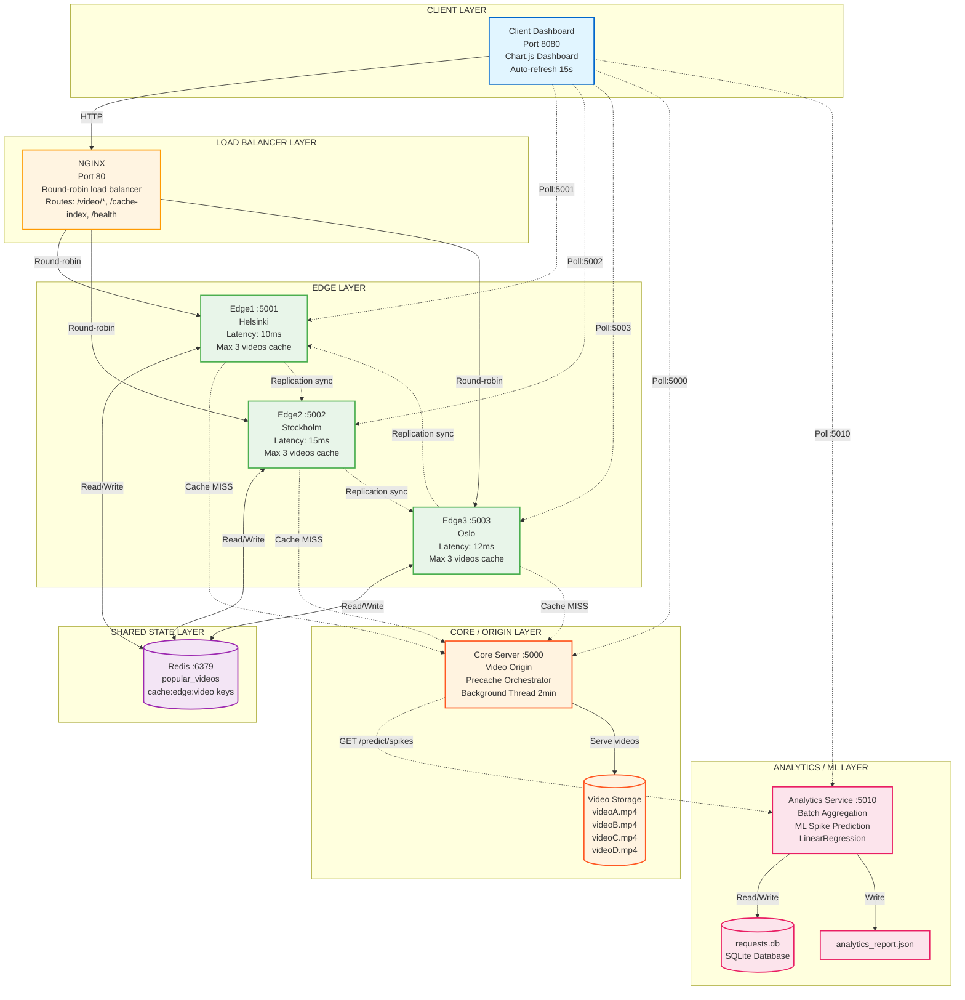
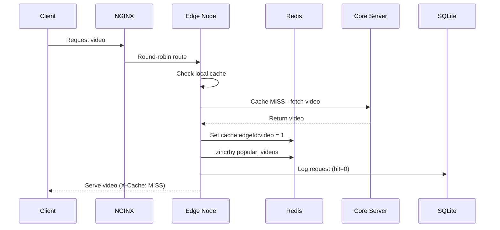
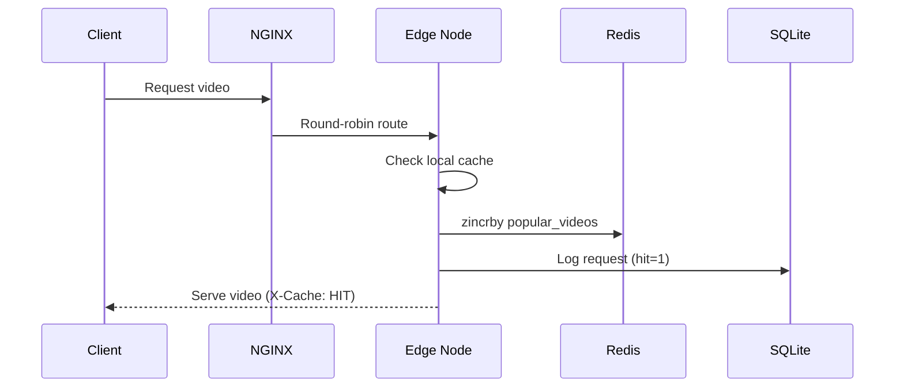
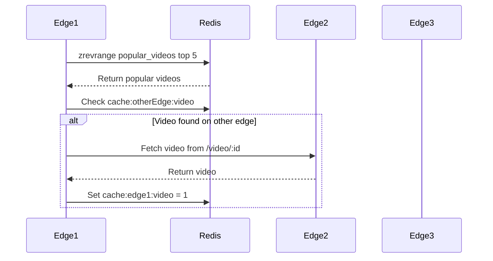
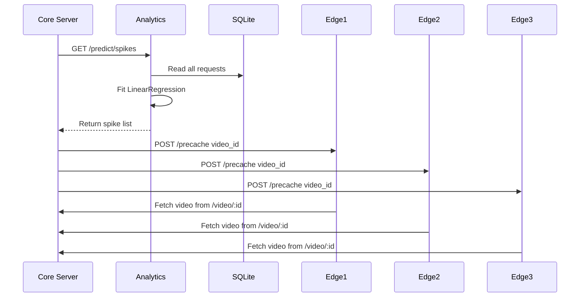
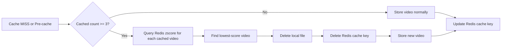
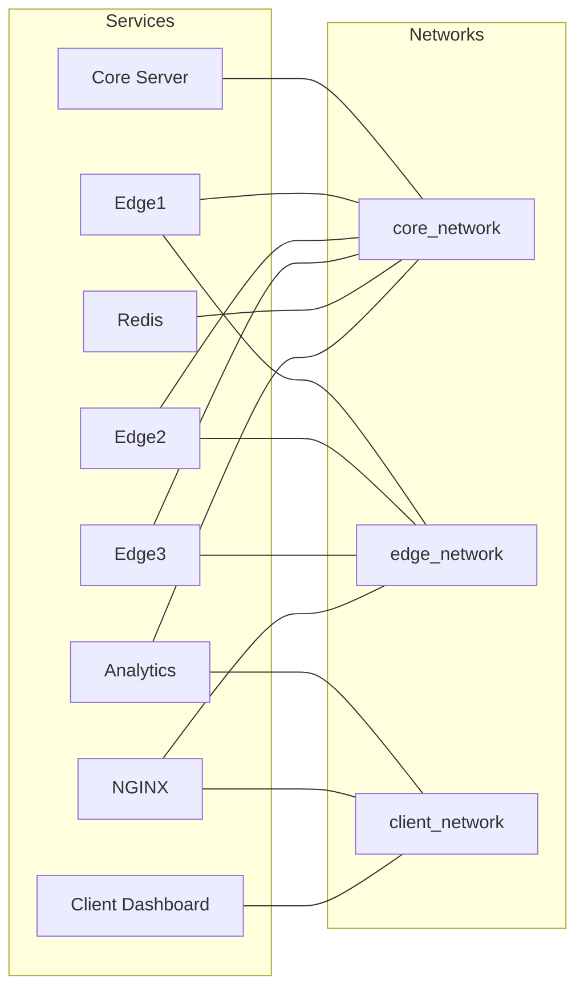

# Telco-Edge CDN Architecture Flowchart

## System Architecture Overview

## Data Flow Sequences

### 1. Video Request (Cache MISS)

### 2. Video Request (Cache HIT)

### 3. Edge Replication Sync (every 30s)

### 4. ML-Driven Pre-caching (every 2 min)

### 5. LRU-Popularity Eviction

## Docker Networks

## Port Mapping

| Service   | Host Port | Container Port |
| --------- | --------- | -------------- |
| core      | 5000      | 5000           |
| edge1     | 5001      | 5001           |
| edge2     | 5002      | 5002           |
| edge3     | 5003      | 5003           |
| redis     | 6379      | 6379           |
| analytics | 5010      | 5010           |
| nginx     | 80        | 80             |
| client    | 8080      | 80             |

## Key Features

- **Edge Caching**: Local file system cache with max 3 videos per edge
- **Load Balancing**: Round-robin across 3 edge nodes
- **Replication**: Edge-to-edge sync every 30 seconds via Redis
- **ML Pre-caching**: Predictive caching based on LinearRegression spike detection
- **LRU Eviction**: Least Recently Used eviction based on popularity scores
- **Analytics**: Real-time dashboard with 15s auto-refresh
