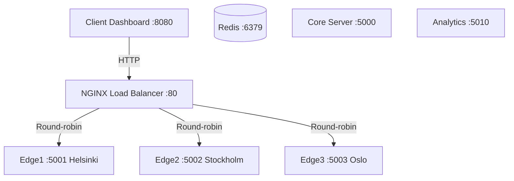

# Telco-Edge CDN - Simple Architecture Diagram

```mermaid
flowchart TB
    CLIENT[Client Dashboard :8080]
    NGINX[NGINX Load Balancer :80]

    CLIENT -->|HTTP| NGINX

    NGINX -->|Round-robin| EDGE1
    NGINX -->|Round-robin| EDGE2
    NGINX -->|Round-robin| EDGE3

    EDGE1[Edge1 :5001 Helsinki]
    EDGE2[Edge2 :5002 Stockholm]
    EDGE3[Edge3 :5003 Oslo]

    REDIS[(Redis :6379)]
    CORE[Core Server :5000]
    ANALYTICS[Analytics :5010]

    EDGE1
```
